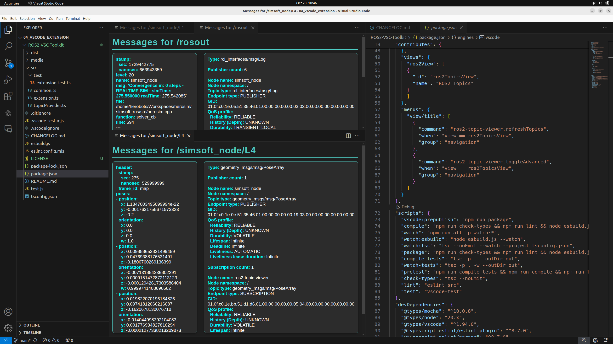

# ROS2 Topic Viewer

## Overview

`ros2-topic-viewer` is a Visual Studio Code extension that allows users to easily view and interact with ROS2 topics directly within the editor. This extension is designed to streamline the development process for ROS2 applications by providing a convenient and integrated way to monitor and debug topics. 

    

## Features

- **Topic List**: View a list of all available ROS2 topics.
- **Message Inspection**: Monitor the messages being published on a selected topic.
- **Advanced Monitoring**: Inspect bandwith and info an a selected topic.

## Acknowledgements

Check out our robotics startup **[HEROBOTS](https://www.herobots.eu/)**. Our mission is to become the leaders of inspection and maintenance in constrained and hazardous environments.

## Upcoming Features

We are evaluating the possibility to ship new features for ROS2 development:
- **Topic filtering**
- **Message Scheme inspection**
- **Direct publishing**
- **Customization Settings**: interval refresh, default filters and more!

## Installation

1. Open Visual Studio Code.
2. Go to the Extensions view by clicking on the Extensions icon in the Activity Bar on the side of the window.
3. Search for `ros2-topic-viewer`.
4. Click `Install` to install the extension.

## Usage

1. Click on the "Turtle Icon" in the lateral Extension Toolbar.
3. The ROS2 Topic Viewer panel will open, displaying a list of available topics.
4. Click on a topic to open a new panel containing all available data.
5. Click on the upper right corner in the Explorer Tab to Refresh topics.

> **NOTE:** After toggling the advanced options you must reopen the topic window to see the changes!

## Contributing

Contributions are welcome! If you have any suggestions, bug reports, or feature requests, please open an issue or submit a pull request on the [GitHub repository](https://github.com/alesof/ROS2-VSC-Toolkit).

## License

This project is licensed under the MIT License.